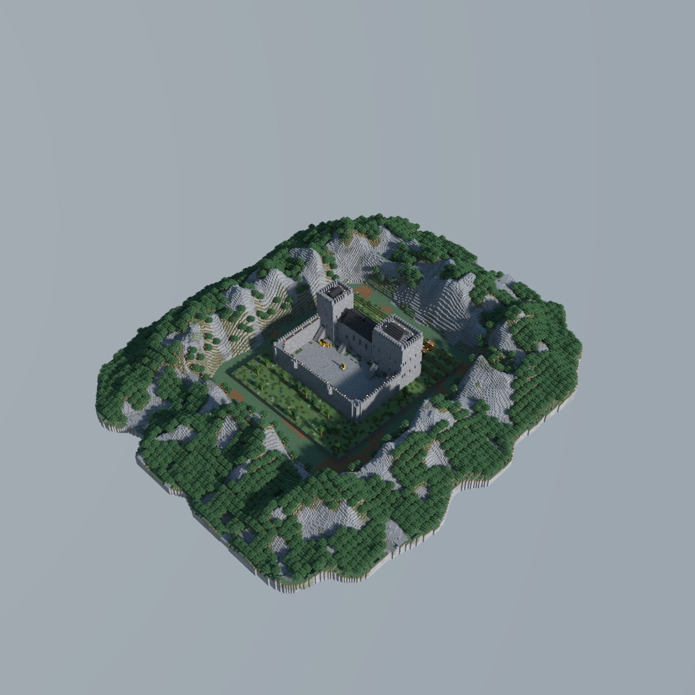
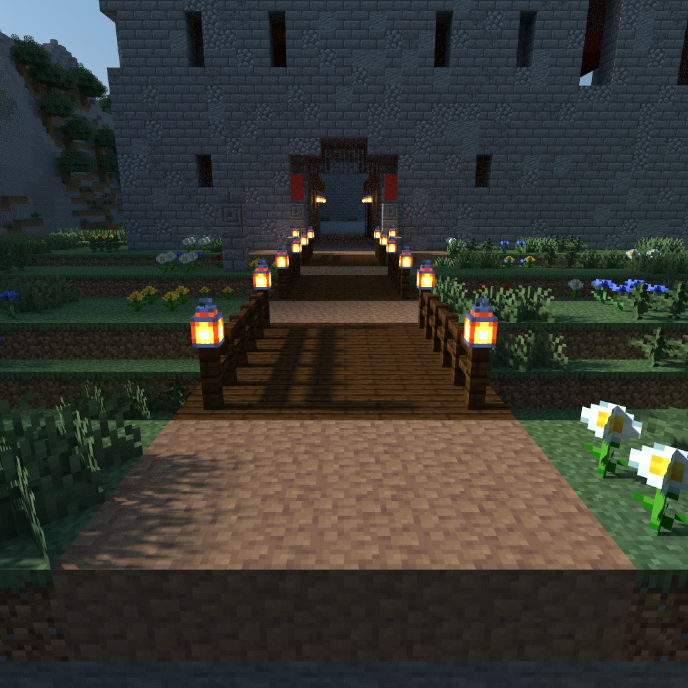

# Doune Castle: A Guided Tour

> **Requires delve engine 0.25.0 or newer** — last verified with delvec 1.5.0 on Minecraft Java 1.21.11.

> *"Mind the stair — the left side is worn through, and has been since before either of us."*

A walk through a real castle with somebody who knows it. Nine stops, one guide, no combat, no grind: about thirty-five minutes if you follow her, longer if you wander, and wandering is allowed from the first minute.



| | |
|---|---|
| **Players** | 1–4 |
| **Playtime** | ~35 minutes |
| **Mode** | adventure, no combat |
| **Languages** | English, 简体中文 (`zh-cn`) |
| **Class** | one — the Visitor: a book, a spyglass, and bread |
| **Source** | Doune Castle, Stirling — late 14th century |
| **Licence** | CC BY-SA 4.0 |

## What it is

The party arrives on the north approach with the whole exterior in front of them. Elspeth Moncrieff has guided at Doune for twenty years; she takes you through the gate passage, the courtyard, the lord's hall and the duchess's, the great hall, the kitchen, the royal apartments, and out onto the wall-walk. Talk to her at a stop and you get that room and a piece of the castle's six centuries — dates as plain numbers, opinions owned out loud. When the conversation closes she walks on and waits.



Every door is open. You can run ahead of her, go down to the cellars alone, find the pit prison under the guardroom, or stand in the oratory she has not mentioned yet.

## The castle is a real one

Doune, in Stirling, late fourteenth century — built for Robert Stewart, Duke of Albany, who governed Scotland without ever being its king. It was chosen because its rooms survive roofed and documented, its plan is a working household rather than a picturesque ruin, and its geometry is rectilinear enough to build honestly.

The layout follows the household's own circulation: the lord over his own gate, so nobody enters unseen by him; the great hall over its cellars with the dais against the lord's door; the kitchen at the hall's far end, feeding it through two hatches; guests over the kitchen, which is the warmest wall in any castle; the garrison on the gate and the wall. Sources are in `design/research.md`.

Scale is 1.5 blocks to the metre. The fourth range was planned and never built.

## Play it

```sh
docker run -it -p 25565:25565 -e EULA=TRUE ghcr.io/stellarfeline/delve-doune-castle-tour:latest
```

That is the current delve. To hold one exact version, take its `:vX.Y.Z` tag from the release page instead; every release names its own.

Start the server, then in the Minecraft Java client at the version the marker above names: Multiplayer → Direct Connect → `localhost:25565`.

Add `-e DELVE_RESET_WHEN_EMPTY=90` and the world is thrown away and built again from the image once nobody has been online for 90 seconds, so the next arrival starts a delve nobody has touched — but then EVERY start resets, and restarting the container under a party ends that party's run. Leave it out and the world is kept. The floor is 60 seconds; below it the server refuses to start.

## Building it

From the root of this repository:

```
delvec build campaigns/doune-castle-tour --prefabs prefabs -o out
```
