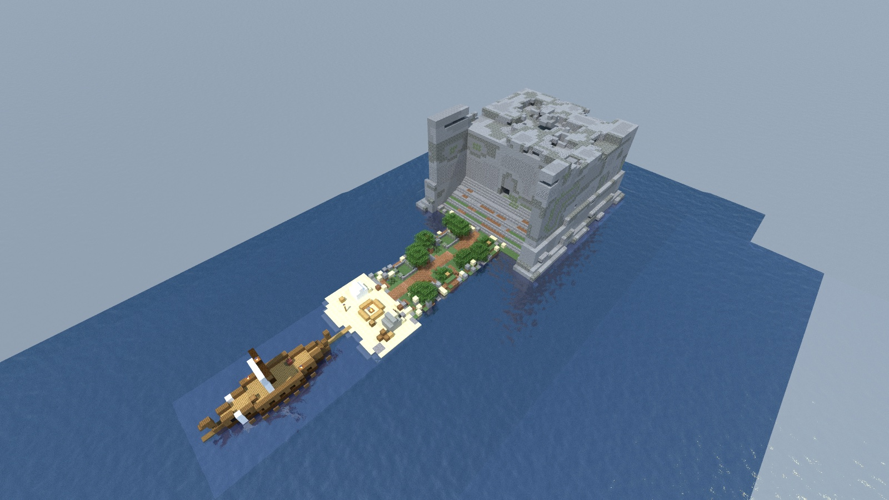

# Nobody's Isle

**v1.0.0** (exact engine pin: `versions.toml`)

> **Requires delve engine 0.8.0 or newer** — last verified with delvec 1.1.0.

> *"Guests, is it. Guests come by the door, little ones. The door was shut."*

A single-player story delve after Book 9 of Homer's *Odyssey* — an island small enough to walk, a ship you can see from the campfire, and a cave you will wish you had only looked at.



| | |
|---|---|
| **Players** | 1 |
| **Playtime** | ~20 minutes |
| **Languages** | English, 简体中文 (`zh-cn`) |
| **Source** | Homer, *Odyssey* Book 9 |
| **Licence** | CC BY-SA 4.0 |

## The story so far

Troy fell ten years ago. The horse at the end was your idea, and everyone has heard the song by now — but the song stops there, because you still are not home. The sea keeps handing you islands instead of Ithaca.

This one, at least, is honest about what it is: a beach, a meadow, a mountain, and nothing else from shore to shore. Your galley rides at anchor a spear-throw off the sand, close enough that you can hear the rigging work at night. The crew have a fire going and no appetite for exploring.

But there is smoke on the mountain. Not your smoke — a thin grey thread from somewhere inside the rock, where nobody with a fire has any business being on an island with no harbour, no plough-land, and no boundary stone. Up the slope, past a sheep-fold that somebody built and something filled, there is a cave mouth with a boulder beside it that forty men could not roll.

Eurylochus wants to take what the island offers and be back at the oars before dark. He is almost certainly right. He usually is.

You are Odysseus. You want to meet whoever lives behind a door that size.

## Who you will meet

**Eurylochus** — your second, and your wife's brother, which is the only reason he is allowed to talk to you the way he does. Blunt, unflattering, and given to counting things aloud: days, jars, men, ways to die. He argues to your face and then does exactly as he is told. Remember that last part. It matters.

**Perimedes** — the quiet hand who does the frightening job before anyone has finished asking. Speaks in nouns and verbs, reports what he can see, and stops.

**Antiphos and Elpenor** — the fire-watch. One has rowed through nine years and two shipwrecks and is impressed by exactly nothing anymore — when you climb, he climbs behind you with the provision sacks, because somebody carries the man's dinner. The other is the youngest man aboard and has, so far, survived everything the world has thrown at him by accident. The beach is his to hold, alone. He is very clear about being fine with that.

**Polyphemus** — a shepherd, of a sort. Poseidon's son, alone with his flock since before anyone thought of building ships. Enormous, unhurried, plain-spoken and without cruelty, he has never in his life had to ask anyone's permission for anything. He will talk to you about guests, and gifts, and law, in the tone of a man reciting rules he owns rather than obeys.

He is monstrous. He is also, if you let him talk, a little pitiable — and knowing which of those two things you are dealing with, and when, is most of this delve.

## What kind of delve this is

Three pillars, in the proportions the source demands: it is mostly **talking**, partly **hiding in the dark while something looks for you**, and once — briefly — a matter of doing an unforgivable thing with a sharpened stick. There is no grinding, no mining, no levelling. Pack nothing: the island will hand you what the story needs, when it needs you to have it.

There is more than one way off this island. How you leave — and under what name — is yours to answer.

Book 9 is not a story about beating something stronger than you. Bear that in mind when you are handed the option to try.

## Play it

One command and the island is up — then Multiplayer → Direct Connect to `localhost:25565`:

```sh
docker run -d --name delve -p 25565:25565 -v delve-data:/data \
  -e EULA=TRUE ghcr.io/stellarfeline/delve-nobodys-cave-island:v1.0.0
```

The release page for each version carries the resource pack (character skins — your client will prompt for it on join) and the full changelog. To start the story over, `docker rm -f delve && docker volume rm delve-data`, then run the same command again.

---

*Adaptation notes, the decisions behind this campaign, and the known limits of the current DSL are recorded in `GENERATION.md` and `DESIGN.md` — those files discuss the plot freely and are not spoiler-safe.*
