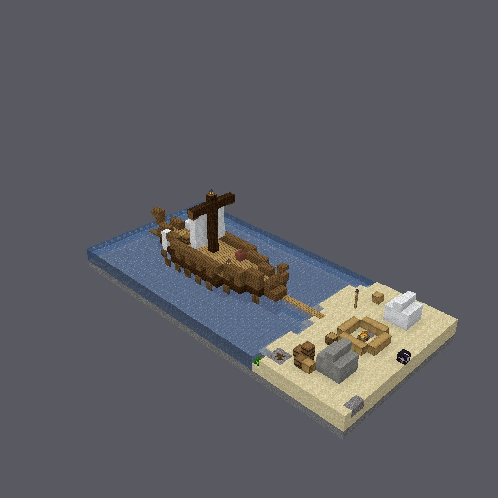
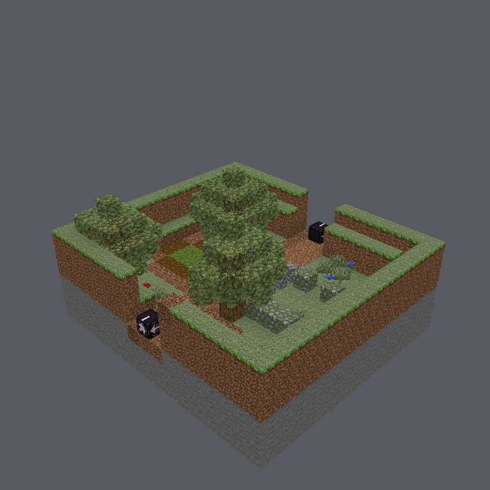

# 无人之岛

> *"客人?客人是走门进来的,小东西们。而门,是关着的。"*

一局到底的联机地窟——一座走得完的小岛,营火边就望得见的船,和一个你会后悔
没有只远远看一眼的洞。



| | |
|---|---|
| **人数** | 1–4 |
| **时长** | 约 2 小时 |
| **职业** | 三选一——上山之前,在营地选好 |
| **语言** | English、简体中文(`zh-cn`) |
| **蓝本** | 荷马《奥德赛》卷九——公有领域 |
| **许可** | CC BY-SA 4.0 |

## 前情

特洛伊十年前就陷落了。最后那匹木马是你的主意,如今人人会唱那支歌——可歌到
那里就停了,因为你还没有到家。大海不肯还你伊萨卡,只是一座接一座地把岛屿
塞到你面前。

至少这一座岛不装模作样:一片滩,一片草场,一座山,从这头到那头再无其他。
你的桨帆船就锚在离沙滩一箭之地的水上,近得夜里能听见索具吱呀作响。船员们
生起了火,没有一个人想去别处看看。

可是山上有烟。不是你们的烟——一缕细细的灰线,从岩石内部的什么地方升起来。
这座岛没有港,没有犁过的地,没有界石,不该有任何生火的人。顺坡而上,过了
一座有人垒起、有什么东西住满的羊圈,是一个洞口;洞口旁立着一块巨石,四十
个人也休想推动它。

欧律罗科斯的意思是:拿上岛上现成的东西,天黑前回到桨位上。他几乎肯定是对
的。他通常都是对的。

而你,想见一见住在那样一扇门后面的东西。



## 你会遇见的人

**欧律罗科斯**——你的副手,也是你妻子的兄弟,这是他敢那样跟你说话的唯一
本钱。说话直,不留情面,爱把东西一样样数出声:日子,酒罐,人头,死法。他
当面跟你争,争完了照你说的办。记住后半句。它要紧。

**佩里墨得斯**——那个别人还没把可怕的差事说完、他已经去做了的安静人。开口
只有名词和动词,报告他看见的,然后闭嘴。

**安提福斯与埃尔佩诺尔**——守火的两个。一个划过九年的桨、沉过两回船,如今
天塌下来也不抬眼;另一个是船上最年轻的水手,迄今为止靠运气活过了世上的一
切。他们负责守住沙滩。这一点他们说得非常清楚。

**波吕斐摩斯**——牧人,姑且算是。波塞冬之子,在有人想到造船之前,就独自
守着他的羊群住在这里。庞大,不慌不忙,言语平直,并无恶意;他这一生,从来
不必征得任何人的许可。他会同你谈客人,谈礼物,谈规矩——用一个背诵自家家法
之人的口吻,那些规矩归他所有,而非他所守。

他是怪物。可若你肯听他说下去,他也有一点可怜——分清此刻面对的究竟是哪一
个,又是在哪一刻换了另一个,便是这局地窟的大半功课。

## 职业

**伊萨卡的奥德修斯**——一位以"不打仗而打赢"闻名的王。短剑,松脂火把,
以及每一个曾经奏效的馊主意的全部记忆。

**波利特斯,先入之人**——每当哪个门洞看着不对劲,船员们就把他往前推。梣木
长矛,牛皮盾,外加彻底缺乏想象力——在这座岛上,那也算一种甲。

**欧律巴特斯,王的传令官**——圆肩膀,尖眼睛,王爱他胜过船上任何人。一张
角弓,一壶苇箭,以及离得远远地使用它们的好见识。

无论选谁,什么都不必带。故事需要你有什么的时候,岛会亲手交给你。

## 这是怎样一局地窟

三根支柱,按原典的比例调配:大半是**交谈**,一部分是**在黑暗里躲避一个
正在找你的东西**,还有一次——很短——要用一根削尖的木棍做一件不可饶恕的
事。没有刷怪,没有挖矿,没有练级。你打得赢的那一仗会自己找上沙滩;打不赢
的那一场标得清清楚楚——毕竟它有半座山那么大,还会吼。

离开这座岛的路不止一条。你如何离开——顶着哪个名字离开——由你自己回答。

卷九讲的从来不是战胜比你强大的东西。当有人把"试试看"递到你手里时,记住
这一点。

## 开玩

```sh
# 游玩(英文)
EULA=TRUE docker compose -f validation/compose.yaml --profile play up

# 游玩并记录创作者笔记
EULA=TRUE CREATOR_NAME=<你的 MC 名> \
  docker compose -f validation/compose.yaml --profile playtest up
```

用主仓库的编译器从源码构建:

```sh
delvec build campaigns/nobodys-cave-island -o out/               # 英文
delvec build campaigns/nobodys-cave-island --lang zh-cn -o out-zh/   # 简体中文
```

---

*改编笔记、本战役背后的取舍,以及当前 DSL 的已知边界,记录在
`GENERATION.md` 与 `DESIGN.md` 中——那两份文件不避剧透。*
