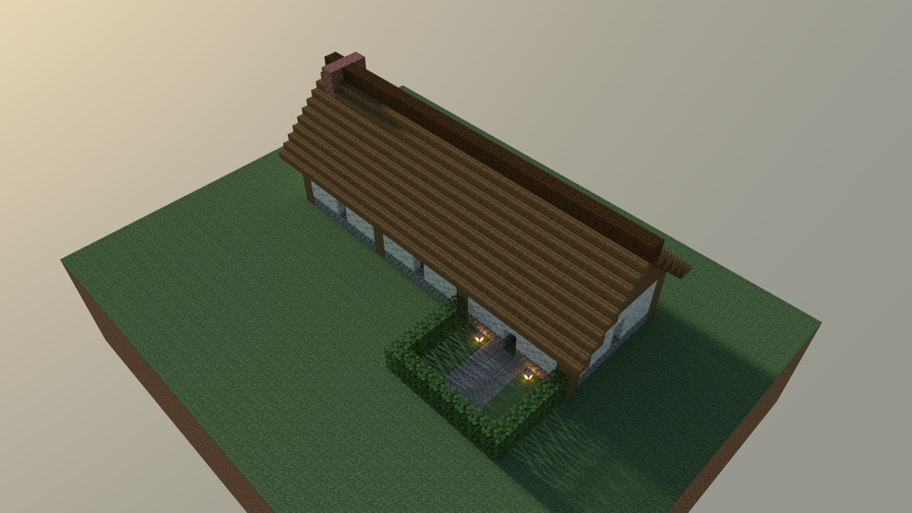

# The Heart Under the Floor

> **Requires delve engine 0.39.0 or newer** — last verified with delvec 1.12.0 on Minecraft Java 1.21.11.

You took the cottage at the end of the lane sight unseen. It is dusk when you
get there: a long, low house of three rooms under one roof, a hedged front
garden, the front door standing open. Nobody has lived in it for a while.

Step inside, and listen.

- **Players**: 1 to 4.
- **Playtime**: about ten minutes.
- **Class**: *Lodger* — a candle, and the key to a door that is already open.

## Playing it

Start the server, then in the Minecraft Java client at the version the marker
above names: Multiplayer → Direct Connect → `localhost:25565`.

Turn your game's sound up. Subtitles on or off, as you prefer.

## For the owner: what to look for

This level is the demo for a sound that beats over a place. Walk it once with
the sound up; each line is one thing to listen for.

1. **Does the beat start when you step inside?** Walk from the garden through
   the front door into the front room. The first heartbeat should come on the
   tick you are a couple of steps in — not before, out in the garden.
2. **Is it heard in every room, and loudest at the hearth?** Walk slowly west
   through the parlour into the kitchen. It should grow steadily louder all the
   way to the fireplace, and never drop out in between.
3. **Does the far room hear what was promised?** Stand in the front room's far
   corners (east end, by the window). The beat there was set at 40% of its
   loudness at the hearth: faint, but plainly there. Is that the right
   loudness for the room farthest from the fire?
4. **Does it quicken when the hearthstone lifts?** Click the stone in front of
   the fire. The slow beat (one every second and a half) should give way at
   once to a faster, slightly higher one (about three every two seconds).
5. **Does it stop within one beat when you find what beats?** Open the little
   barrel under where the stone was and take what is inside. The beat should
   stop by the next interval — at most one more beat — and stay stopped.
6. **Out in the garden, is it silent?** The beat is heard inside the cottage
   and nowhere else: step back out into the garden while it is beating and
   the next beat should not reach you.
