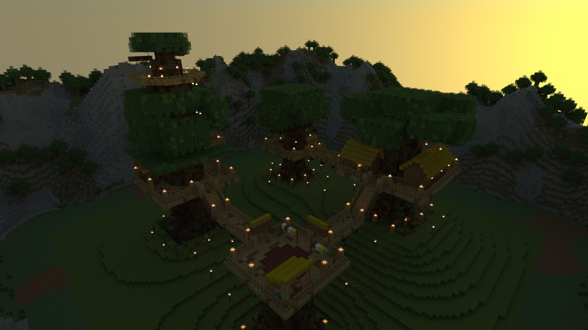
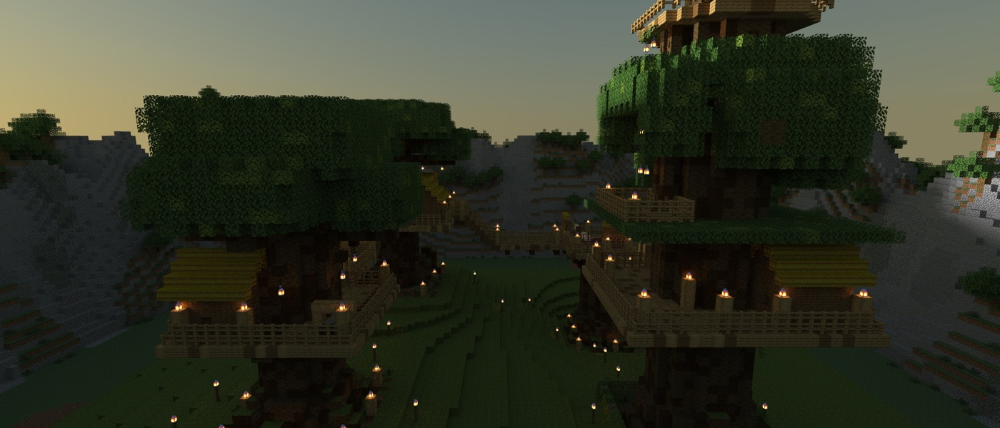

# The Treehouse Camp

> **Requires delve engine 0.38.0 or newer** — last verified with delvec 1.11.0 on Minecraft Java 1.21.11.

A short, gentle delve for a small party of guests: a forest clan's camp of treehouses on four giant trees, rope bridges between them, rope ladders up their trunks, and one night of the year when every house hangs out its lanterns.



| | |
|---|---|
| **Players** | 1–4 |
| **Playtime** | 15–30 minutes |
| **Mode** | adventure, no combat |
| **Languages** | English, 简体中文 (`zh-cn`) |
| **Class** | one — Guest of the Clan |
| **Licence** | CC BY-SA 4.0 |

## The story so far

The Greatwood is an old forest of giant trees, each wide enough at its foot for a house to stand between its roots. The Greatwood clan lives in it, off the ground: four trees at the corners of a rough square, a house built round each trunk high above the forest floor, and rope bridges strung between them.

You are the clan's guests. You arrive among the roots of the tallest-housed tree in the late afternoon, on the one evening of the year the clan calls Lantern Night, and a boy is waiting for you at the foot of a rope ladder.

## Who you will meet

**Tobi** — a boy of the clan, sent down to meet you. He climbs the ladder every day and will tell you plainly that he is afraid of it.

**Oru** — the clan's headwoman, keeper of the hearth in the highest house. She has been part of Lantern Night longer than anyone can remember.

**Neve** — the weaver, at her looms on the flat top of a tree that lost its crown long ago. Quick, practical and busy.

**Hessel** — the oldest person in the camp, nut-presser and seed-keeper, slow, cheerful and glad of anyone who will listen to him.



## What kind of delve this is

A walk and a climb, in adventure mode. Nothing in the camp is hostile.

**Climbing.** Rope ladders hang on the bark of the trees. Walk into one and hold forward (or jump) to climb; let go to slide down; hold sneak to stop where you are.

**Bridges.** Every platform and every bridge has a rail. The bridges climb and fall by plank steps between houses at different heights.

**The forest floor.** If you find yourself on the ground, the paths under the bridges are lit, and every way leads back to the glade at the foot of the first ladder.

**Pack nothing.** You are given what a guest carries: good boots and a little food.

## Play it

One command and the camp is up — then, in the Minecraft Java client at the version the marker above names: Multiplayer → Direct Connect → `localhost:25565`:

```sh
docker run -d --name delve -p 25565:25565 -v delve-data:/data \
  -e EULA=TRUE ghcr.io/stellarfeline/delve-the-treehouse-camp:latest
```

That is the current delve. To hold it at one exact version, take the `:vX.Y.Z` tag from a release page instead; every release names its own. Your client will offer a resource pack when you join (character skins and the Chinese text); accept it. To start the story over, `docker rm -f delve && docker volume rm delve-data`, then run the same command again.

---

*The design of this campaign and the decisions behind it are recorded in `DESIGN.md` and `GENERATION.md`. Those files discuss the whole story, including its ending, and are not spoiler-safe.*
