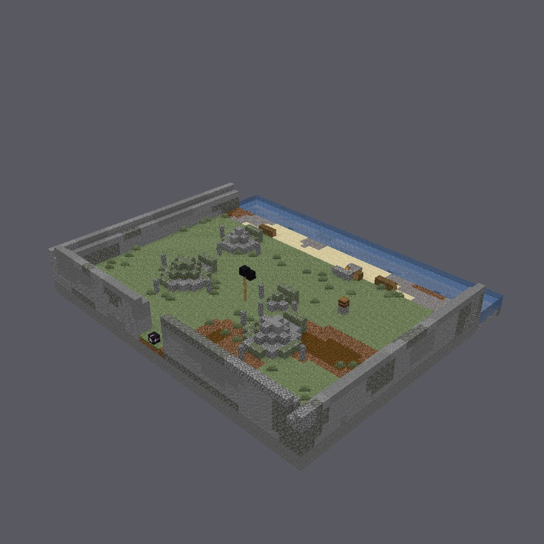
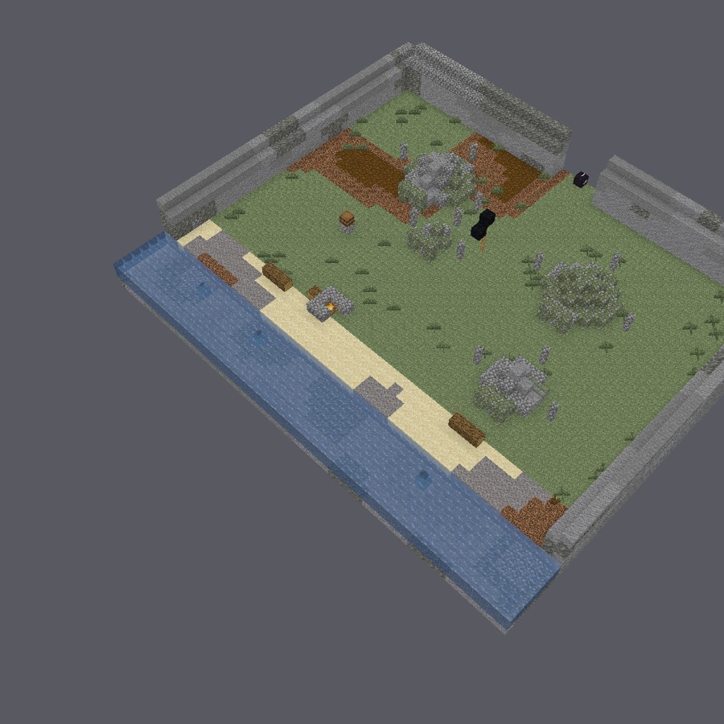

# 守灵

> *「他们都在等一句话，按规矩这句话是你们的，因为是你们把她抬上这条路的。」*

一场只需一个傍晚的短程冒险：海边一片围墙里的坟场，一块木板上的遗体，
以及一家说不出口的人。



| | |
|---|---|
| **人数** | 1–4 人 |
| **时长** | 约 15 分钟 |
| **职业** | 三种，上岸时选择 |
| **语言** | English、简体中文 |
| **战斗** | 没有。这场冒险里没有任何东西能伤到你。 |
| **许可** | CC BY-SA 4.0 |

## 故事从这里开始

雷恩·阿什洛替海岬上的堡垒读了三十年的潮水——堤道什么时候会干、渔船什么时候
能越过沙坝进港、哪个早上的水面在撒谎。这一带没有人比她读得更准。她哥哥过不去
的，正是这一节。

八天前，她读着潮水淹死了。海把她留到昨天才还回来。

你们是这一带的生人。低潮时你们抬着一块木板上了岸，因为路上需要有人的时候，
正好是你们在路上。等你们把她放到冢野正中那面黑幡底下，才发现整片野地的人
从晌午就站在那儿了——等的就是这个。



守灵可以开始了。但它结束不了，因为没有人肯说那句话。

野地的规矩又老又短：死者入土，或者死者归海，而这句话由家里人说。雷恩没有留下
交代。她哥哥自从他们把她抬上来就守在海边那堆火旁，一次也没有回头往北看。守冢人
天一亮就没等谁开口，自己把坑挖开了；她有她的看法，会用大约十一个字说给你听。

按同一条规矩，抬遗体的人可以替家里说这句话。今晚，那就是你们。

## 你会遇见的人

**塞奇，守冢人。** 这片野地归她管，管了很久了。你问她一个人的事，她答你的是土、
是天气、是两锹沙底下的黏土能扛多久。这不是搪塞——这是她面对这种事时唯一会用的
说法，而她用得很温和。还没有人开口求她，坑就已经挖开了；她不觉得这需要解释。

**哈利斯·阿什洛。** 雷恩的哥哥。他说话的样子，像是停下来会更难受：说得太多，
然后为说得太多道歉，然后有一句话说到一半就没了。他知道那句话该由他说，也知道
自己说不出来，而且他并不假装不是这样。他对你们的感激，让人不太好意思待在原地。

**这片野地。** 一个提灯的人从堡门那边下来，灯是点着的。一个女人从早上起就没有
离开过木板。西边侧翼上有位老者守着自家的坟，东边有个孩子只走到某个距离就停下。
他们谁也不会向你们要什么。他们都在等。

## 三种职业

**抬棺人**——上坡那一路，木板的前头是你扛的，至今没人开口来换你。守灵灯在你手上。

**苇笛手**——坑前照例要有一声响，而带着能出声的东西的人，是你。

**坟前童**——花是你捧着的：年纪轻的总归要捧花，而这里没人问过你多大。

## 怎么玩

在仓库根目录构建并运行：

```
delvec build campaigns/the-wake -o campaigns/the-wake/out
EULA=TRUE docker compose -f validation/compose.yaml --profile play up
```

中文文本请用 `--lang zh-cn` 构建。

这里没有要打的东西，也没有要解的谜。走上野地，站着听完那段礼，
等他们问你的时候，回答。
