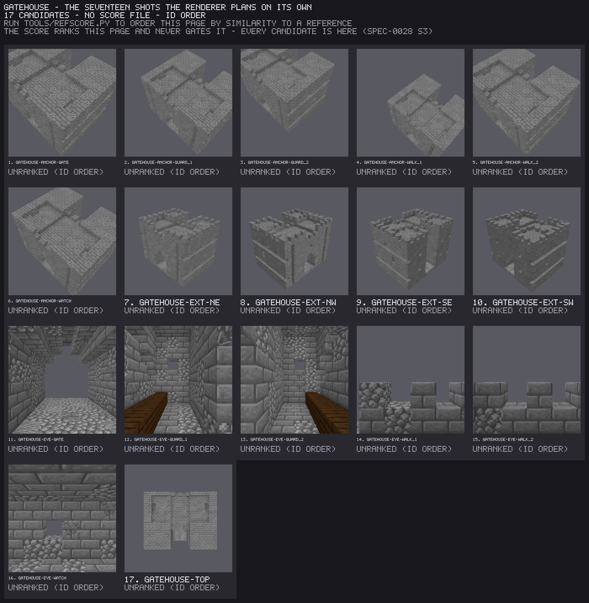
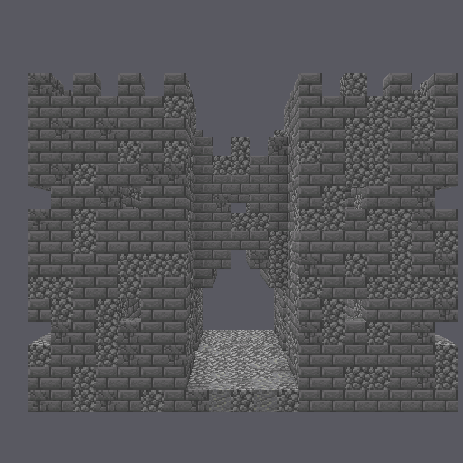
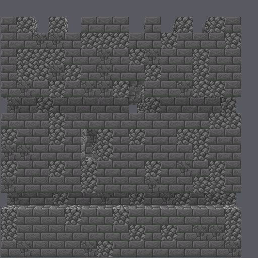
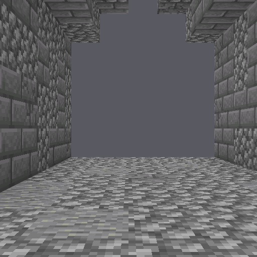

# The Gatehouse Elevations

One small gatehouse, photographed twice out of the same bytes. The first set is
everything the renderer plans on its own. The second is three cameras aimed by
hand at the faces a reviewer actually asks about.

The demo is about the second kind — `delve-render --view`, which is **a bearing
plus a subject box**.

---

## The piece

A gatehouse nineteen blocks wide, fifteen tall and fifteen deep. A party walks
in from the north into a roofless court five blocks wide, walled fifteen courses
on both sides by the two towers that project past the gate block. At the back of
the court is a pointed arch, five wide and six high, opening into a ten-block
tunnel. Three murder holes pierce the vault over that tunnel, and a chamber sits
above it with an arrow loop front and back.

A door just inside the arch opens into a guard room in each tower, benched the
length of one wall. From each guard room a mural stair climbs inside the wall
— one cell per course, lit through two loops — to the upper floor, which runs
unbroken through both towers and the chamber over the arch, and on to the
parapet walk behind the tower caps.

Every cell of floor under a roof can be walked to from the way in. The gates say
so, and they are re-run below.

Six anchors are declared for a campaign to attach to: `anchor/gate` at the mouth
of the arch, `anchor/watch` in the chamber over it, `anchor/guard-1` and
`anchor/guard-2` in the two guard rooms, `anchor/walk-1` and `anchor/walk-2` on
the parapet.

---

## What the planned set cannot show you

A reviewer looking at a piece asks one question: *is this the thing it is meant
to be?* For a gatehouse that question is answered by the front — the two towers,
the court between them, the arch a party walks under.

The seventeen cameras the renderer plans do not hold that picture. Every one of
them, with the bearing it used:

| shot | kind | yaw | pitch | field of view |
|---|---|---|---|---|
| `ext-ne` | exterior | 45 | 30 | 45 |
| `ext-se` | exterior | 135 | 30 | 45 |
| `ext-sw` | exterior | 225 | 30 | 45 |
| `ext-nw` | exterior | 315 | 30 | 45 |
| `top` | plan | 0 | 90 | 45 |
| `anchor-gate` | surroundings | 45 | 55 | 45 |
| `anchor-guard_1` | surroundings | 45 | 55 | 45 |
| `anchor-guard_2` | surroundings | 45 | 55 | 45 |
| `anchor-walk_1` | surroundings | 45 | 55 | 45 |
| `anchor-walk_2` | surroundings | 45 | 55 | 45 |
| `anchor-watch` | surroundings | 45 | 55 | 45 |
| `eye-gate` | eye | 180 | 0 | 70 |
| `eye-guard_1` | eye | 0 | 0 | 70 |
| `eye-guard_2` | eye | 0 | 0 | 70 |
| `eye-walk_1` | eye | 180 | 0 | 70 |
| `eye-walk_2` | eye | 180 | 0 | 70 |
| `eye-watch` | eye | 0 | 0 | 70 |

An elevation is a camera that is **level, square-on, and outside the piece**.
Eleven of the seventeen are not level — they look down from a corner bearing, or
straight down. The other six *are* level and cardinal, and every one of them
stands **inside**: they are a body's eye at 1.62 above a declared anchor. So the
west front, the flank and the arch have no picture in the piece's own review
set, and the planned set is complete and correct while containing none of them.

That claim is a property of the manifest, not of this page — read it off the
file:

```sh
python3 - <<'PY'
import json
p = json.load(open("review/planned-shots.json"))["shots"]
outside_and_level = [s["name"] for s in p if s["pitch"] == 0 and s["kind"] != "eye"]
print(f"{len(p)} planned camera(s); level cameras outside the piece: "
      f"{outside_and_level or 'none'}")
PY
```

Here is the whole planned set on one page. Look for the front.



The set is doing its job. The corner isometrics carry the massing, the plan
carries the layout, and the eye shots carry what a body sees — the tunnel, the
benched guard rooms, the merlons at a sentry's knee. None of them answers *is
this a gatehouse*, and a reviewer handed only this page answers about the
instrument instead.

---

## The three aimed cameras

Same bytes, three more cameras:

```sh
delve-render piece gatehouse.nbt -o review/aimed --size 512 \
    --view name=north-front,face=north,of=model \
    --view name=west-flank,face=west,of=model \
    --view name=gate-arch,face=north,of=anchor/gate
```

**`face=north,of=model` — the approach.** Two crenellated towers, the court
between them, the pointed arch at its back and the road running in.



**`face=west,of=model` — the flank.** The two string courses, the two stair
loops, and the tower cap standing two courses above the parapet walk.



Both frames are filled by the face at `zoom=1`, and that is the point of naming
a `face=` rather than a `yaw=`. A `face=` view frames **that face**, not the
whole box: the flank camera fits a 15 × 15 wall rather than backing off far
enough to hold fifteen blocks of depth behind it. Without that, an author tunes
a `zoom=` by eye and rediscovers a different one for the next building.

**`face=north,of=anchor/gate` — the arch.** `of=` names the subject box, and an
anchor is one cell, so the standoff here is one cell's worth: the camera stands
where a party stands, at the mouth, and the arch fills the frame.



The two halves of the surface are independent, and these three show it. The
front and the arch share a bearing (`face=north`, yaw 180) and differ only in
subject; the front and the flank share a subject (`of=model`) and differ only in
bearing.

### Both sets are of the same bytes

The aimed run re-renders the seventeen planned shots as well as the three it
adds, so the two sets have seventeen frames in common. Rebuild both (below) and
compare them — 17 of 17 are byte-identical, which is what makes this a
comparison rather than two pictures of two buildings:

```sh
for f in review/planned/*.png; do
    cmp -s "$f" "review/aimed/$(basename "$f")" || echo "DIFFERS: $f"
done
```

Only the three new frames are kept here, beside both runs' shot manifests; the
contact sheet above is what the other seventeen are for.

### What is in this directory

| path | what it is |
|---|---|
| `gatehouse.program.json` | the grammar program — the piece's source of record |
| `gatehouse.nbt` | the piece |
| `gatehouse.json` | its metadata: the six anchors, and the program hash and seed that regenerate the bytes |
| `gatehouse.report.json` | the gate verdicts and measurements of the expansion |
| `review/planned-set.png` | the seventeen planned shots on one page |
| `review/planned-shots.json` | what each of those seventeen cameras did |
| `review/aimed/` | the three frames the aimed run adds |
| `review/aimed-shots.json` | all twenty cameras of the aimed run, each view with its spec, aim point and zoom |
| `review/refusals.txt` | every `--view` refusal, as the tool prints it |

---

## What a view refuses

A review set that silently drops the one camera the reviewer asked for still
looks complete in a directory listing. So a view is refused, by name, **before a
single frame renders**: none of the four runs below writes a file, and none of
them creates its output directory at all.

The transcript is `review/refusals.txt`; every message here is the one the tool
printed.

**A subject the piece does not declare.** The message lists the ones it does, so
a mistyped anchor is a one-line fix rather than a hunt:

```
$ delve-render piece gatehouse.nbt -o review/aimed --size 512 \
      --view name=portcullis,face=north,of=anchor/portcullis
DW0721 [error] view aims at `anchor/portcullis`, which this piece does not
declare. Declared anchors: anchor/gate, anchor/guard-1, anchor/guard-2,
anchor/walk-1, anchor/walk-2, anchor/watch
exit 2
```

**A bearing given twice.**

```
$ delve-render piece gatehouse.nbt -o review/aimed --size 512 \
      --view name=north-front,face=north,yaw=180
DW0721 [error] view states both `face=` and `yaw=` — a camera has one bearing.
Use `face=` for a square-on elevation, `yaw=` for any other angle
exit 2
```

**A bearing omitted.** A camera with no bearing is not a camera:

```
$ delve-render piece gatehouse.nbt -o review/aimed --size 512 \
      --view name=north-front,of=model
DW0721 [error] view `name=north-front,of=model` states no bearing — give
`face=<north|south|east|west|up|down>` for a square-on elevation, or
`yaw=<degrees>`
exit 2
```

**A name a planned shot already holds.** Rendering it would overwrite that
image, and the set would come back one shot short of what it claims:

```
$ delve-render piece gatehouse.nbt -o review/aimed --size 512 \
      --view name=top,face=up
DW0721 [error] view `top` is already the name of a plan shot in this set —
rendering it would overwrite that image. Give the view its own `name=`
exit 2
```

**A view that frames empty air.** Asking for a closer look at the arch with a
large `zoom=` pushes the camera past the fit distance and into the masonry. The
frame is written, and it is reported with the bearing and the zoom that produced
it, so the blank picture is never read as an answer:

```
$ delve-render piece gatehouse.nbt -o review/aimed --size 512 \
      --view name=gate-close,face=north,of=anchor/gate,zoom=8
DW0727 [warning] gatehouse/gate-close: the declared view
`name=gate-close,face=north,of=anchor/gate,zoom=8` is an EMPTY frame (1 distinct
colour(s)) — a camera aimed at anchor/gate on bearing yaw 180 pitch 0 at zoom 8
sees nothing but flat background. A zoom past the fit distance puts the camera
inside the model, and a cutaway can strip the only layer there was. The picture
this view was asked for is NOT in this set; re-aim the view — never read the
blank frame as the answer
exit 0
```

That one rides the run's own shot manifest as well as the terminal, because a
camera that ended up somewhere unintended is invisible in its own frame.

---

## Build it yourself

Everything here is rebuilt from `gatehouse.program.json` and two tools built
from source. Clone the pipeline repository,
[stellarfeline/delvewright](https://github.com/stellarfeline/delvewright), then,
from its root:

```sh
cargo build --release -p delvewright-grammar --bin delve-grammar
cargo build --release --manifest-path crates/render/Cargo.toml --bin delve-render
export PATH="$PWD/target/release:$PWD/crates/render/target/release:$PATH"
```

`delve-render` is its own cargo workspace, which is why it is built by manifest
path rather than by `-p`. It needs the Minecraft 1.21.11 client jar for
textures, found at `--textures <path>`, `$DELVEWRIGHT_CLIENT_JAR`, or
`~/.chunky/resources/minecraft.jar`.

Then, from this directory:

```sh
delve-grammar expand --file gatehouse.program.json --region 19x15x15 --seed 1 \
    --id gatehouse --traversable --reachable-floor -o .

delve-render piece gatehouse.nbt -o review/planned --size 512

delve-render piece gatehouse.nbt -o review/aimed --size 512 \
    --view name=north-front,face=north,of=model \
    --view name=west-flank,face=west,of=model \
    --view name=gate-arch,face=north,of=anchor/gate

delve-render contact-sheet review/planned -o review/planned-set.png \
    --columns 5 --thumb 256 \
    --title "gatehouse - the seventeen shots the renderer plans on its own"
```

The expansion prints its verdicts and its binding count per gate. All of them
pass, and two are worth reading rather than skimming: `traversable` walks a body
from the approach face to the exit face, and `reachable-floor` reports 287
standable cells under a roof with none of them stranded. The `.nbt` is a pure
function of the program, the region and the seed (ADR-0006) — re-expanding
produces the same 10,715 bytes.

Renders are validation artifacts and are deliberately not byte-stable, so the
PNGs a rebuild writes may differ from the ones committed here. The manifests and
the verdicts do not.

---

## What this demo does not claim

The piece declares **no spatial contract**, so every contract obligation over it
examines nothing and the expansion says so as a finding. What the building is —
which space is enclosed, which edge is a way in, which envelope is open to the
sky — is therefore unstated, and nothing downstream can check that this piece
fits a neighbour. That is a different capability with a demo of its own; this
one is about where the camera stands.
