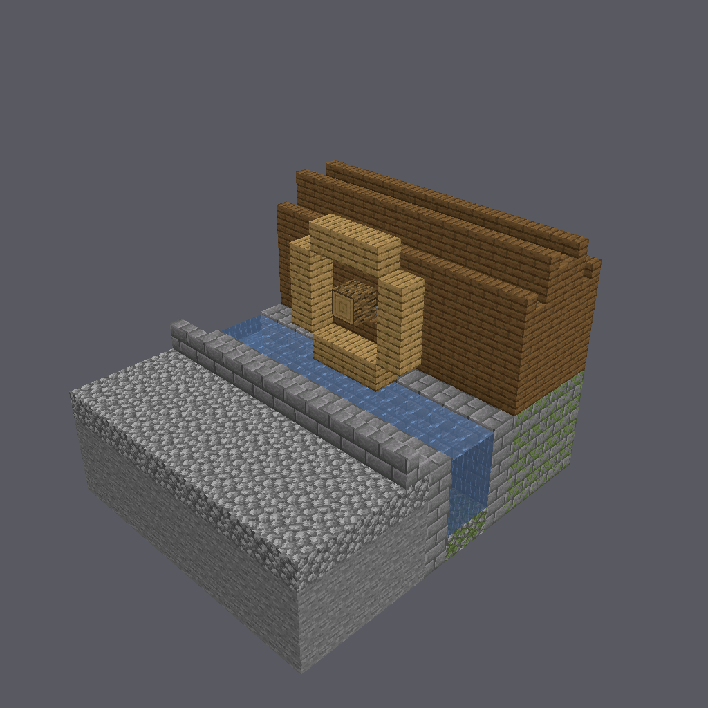
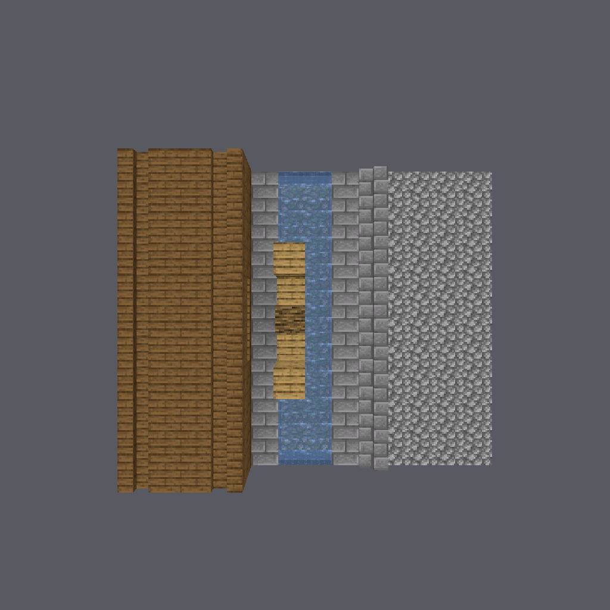

# The Mill Race

One small water-mill yard, built twice out of one program. The version a render
approves, and the version the server keeps.

The two are **one property and one course** apart, and the first one photographs
beautifully. A picture shows you what the bytes say — and neither of the two
things wrong with that yard is what the bytes say. Each is a claim the world
re-decides for itself, the first time anything happens next to it.

Two rules ask the question a picture cannot:

- **`DW0801`** — a stair's `shape` is not a stored fact. Vanilla recomputes it
  from the stair's own neighbours on every horizontal block update at that cell,
  so a written `shape` is a *claim about the four cells around it*.
- **`DW0800`** — a body of fluid runs. Water and lava are the only blocks you
  place that move on their own, and they move on the server's clock, before
  anybody arrives.

---

## The yard

Thirteen blocks across, nine tall, eleven deep.

A cobbled yard fills the west third, walked at the fourth course. Its east edge
is a **kerb** — eleven stone-brick stairs in a line, low side to the yard, so you
step up onto it and look down into the water.

Beyond the kerb the **race** runs the full depth of the piece: a mossy bed, a
channel two blocks wide and three courses deep, and a wall of stone bricks either
side rising to the brim. The race enters at one end of the piece and leaves at
the other; it is a length of a longer watercourse, not a pond.

An **oak wheel** five blocks across straddles the race, hub on a log axle, rim
turning just clear of the water.

The east third is the **mill** — a mossy stone base, spruce above it, one barred
window on the race side, and a gabled roof of spruce stairs.

Ninety-six cells of floor, all of them reachable on foot from twenty-seven ways
in at grade.





---

## One property and one course

Both versions come out of `mill-race.program.json`. The kerb is a palette role
and the west race wall's height is a parameter, so the second version is the
first with two overrides on the command line — nothing else in the program, the
region or the seed moves.

```sh
# the yard the server keeps
delve-grammar expand --file mill-race.program.json \
    --region 13x9x11 --seed 1 --id mill-race -o .

# the yard as drawn
delve-grammar expand --file mill-race.program.json \
    --region 13x9x11 --seed 1 --id mill-race-as-drawn \
    --role 'kerb=minecraft:stone_brick_stairs[facing=west,half=bottom,shape=outer_left,waterlogged=false]' \
    --param wall_head=3 -o .
```

**The property** is `shape=straight` becoming `shape=outer_left` — a mitred kerb,
pointed across its run instead of along it. **The course** is the west race
wall's fourth course, the one that stands beside the top course of water.

Each override is also run on its own, so that "one property and one course" is a
measurement rather than a claim. All four runs are in `runs.txt`, and each writes
its own report:

| run | overrides | filled cells | distinct states | entry cells | `stair-shape` | `fluid-contained` | exit |
|---|---|---:|---:|---:|---|---|---:|
| the yard the server keeps | none | 794 | 14 | 27 | pass, 55 | pass, 66 | 0 |
| the property alone | `--role kerb=…outer_left` | 794 | 14 | 27 | **`DW0801`**, 55 | pass, 66 | 4 |
| the course alone | `--param wall_head=3` | 783 | 14 | 25 | pass, 55 | **`DW0800`**, 66 | 4 |
| the yard as drawn | both | 783 | 14 | 25 | **`DW0801`**, 55 | **`DW0800`**, 66 | 4 |

Read the second row across. The property override changes **no cell of the
piece**: same 794 filled cells, same 14 distinct block states, same 96 standable
cells, same 96 reachable, same 55 stairs, same 66 cells of water. One string in
one palette role is different, and one gate goes red.

Read the third row. The course override changes exactly eleven cells — 794 to
783, one course of one wall over eleven blocks of depth — and moves no block
state at all: still 14, and still 96 standable cells, all 96 reachable. The one
other number that follows it is the count of ways in at grade, 27 to 25: the head
of that wall was a cell a body could stand on at the edge of the piece, and it is
now a course lower.

---

## What the two rules print

### The kerb

```
stair-shape     FAIL  bound 55     DW0801: 11 of 55 stair(s) claim a `shape` the
game does not derive at their cell — 4,4,0 minecraft:stone_brick_stairs
facing=west half=bottom is written shape=outer_left and derives shape=straight;
4,4,1 … (+5 more). A stair's shape is NOT stored: vanilla recomputes it from the
stair's neighbours on every horizontal block update, so this piece renders one
way in every tool here and resets in the world. Build the neighbours the shape
needs, or write the shape the neighbours give
```

Fifty-five stairs are examined and eleven of them are wrong: the kerb. The
forty-four in the mill's roof are written `straight` and derive `straight`, for
two different reasons worth separating. Across the facing axis of an eaves stair
there is planking on one side and nothing at all on the other, and a cell that
holds no stair cannot turn a corner. The two ridge stairs *do* have a stair
across that axis — each other — but a corner is only turned by a neighbour facing
onto a **different** axis, and those two face along the same one. The kerb has
air on both sides, so it derives `straight` too, and claims `outer_left`.

Each line carries the cell, the block, its `facing` and `half` — the two
properties the derivation reads — and then **both shapes**: what the piece
claims, and what the game will hold. That pair is the before and after of one
cell across one block update, and it is stated for every disagreeing stair, six
by name and the rest counted.

The last sentence names the two repairs, and they are genuinely different
buildings: build the neighbours a mitre needs, or write the shape the neighbours
already give. The kept yard takes the second.

### The channel

```
fluid-contained FAIL  bound 66     DW0800: 11 way(s) out of a body of 66 fluid
cell(s) — 6,3,0 runs into 5,3,0 (minecraft:air); 6,3,1 runs into 5,3,1
(minecraft:air); … (+5 more). A body of fluid is saturated and walled by
construction: every cell a source, and nothing open beside or below it. This
piece renders as still water in every tool here and runs on the first tick in the
world
```

Sixty-six cells of water are examined, and eleven of them have somewhere to go:
the top course of the channel, at every depth along it, running west into the
course of wall that is not there. The message names the cell the water is in and
the cell it runs into, **and what is in that cell as written** — here
`minecraft:air`, which is the only thing that counts as open. A block written
`waterlogged=false` is a wall; a block written `waterlogged=true` is a still cell
that spreads nothing.

Fluid never runs upward, so the open top of the race is not a leak. An authored
pool is a pool.

---

## Why no picture settles either of these

Both defects are invisible to every tool that draws the bytes, and that is not a
shortcoming of any particular renderer — it is what the two properties *are*.

- The render draws the `shape` the stair carries, which is exactly the claim
  under dispute. Ask a picture whether a mitre is real and it answers *yes*,
  because the mitre is in the bytes it was handed.
- The render draws still water everywhere a water source sits. Water that is
  about to leave is drawn in the place it is about to leave.

So the drawn yard would photograph as a tidy mitred kerb beside a brimming
channel, be approved, and reach a server that quietly flattens the kerb and pours
the race across the yard.

**There is no picture of the drawn yard in this directory, and there cannot
be one.** The runs that would produce those bytes end like this:

```
error: mill-race-as-drawn: a machine gate went red; no prefab was written.
```

No `.nbt` is written for a piece that fails either rule, so there is nothing to
render — and the settled state has no bytes either, because water in flight is
mid-flow water, which a piece is not allowed to pin. The only picture this
toolchain will take of a mill race is a picture of one that is true.

What that leaves for the kerb is exact, and it is the pair of images the two
gates promise: `views/mill-race-top.png` is the drawn yard's eleven kerb cells
**after one block update**, block for block, because the kept yard writes at
those cells precisely the `straight` the drawn yard settles to. The picture of
them before the update is the one the engine refuses to make.

---

## The direction the fluid rule will not judge

The kept yard passes `fluid-contained`, and its line says more than *pass*:

```
fluid-contained pass  bound 66     66 fluid cell(s), every one a source with
nothing open beside or below it; 12 run direction(s) leave the piece (from
6,1,0, 6,1,10, 6,2,0 and others) — what is beyond a face is not in these bytes,
so this is counted and not judged. The placement decides it: `DW0318` refuses
this water if the piece is placed against nothing under a void horizon
```

The race runs off both ends of the piece: six cells of water at each end, facing
a cell this piece does not contain. That is a mill race behaving like a mill
race, and no rule about these bytes can decide it — what is on the other side of
a face belongs to whatever the piece is placed against. It is counted every time
and never red.

It is not forgotten either. Once the piece is placed, the build takes the whole
assembled world and refuses any fluid cell that ends up outside every placed
piece under a void horizon (`DW0318`). Place this yard so the race runs into
open sky and the build stops; place it against the next length of channel, or
under an ocean horizon, and the water has somewhere to be.

Run the same rule over the frozen bytes and it says the same thing, with its
binding counts on the record:

```
$ delve-admit audit mill-race.nbt
DW0800 [warning] a body of fluid reaches this piece's own outer face in 12 run
direction(s) …
```

`"stairs_examined": 55`, `"fluid_cells_examined": 66`, `"fluid_at_edge": 12`,
verdict `pass`. The transcript is `audit.txt`.

---

## What is in this directory

| path | what it is |
|---|---|
| `mill-race.program.json` | the program both versions come from |
| `mill-race.nbt` | the yard the server keeps — 3,177 bytes |
| `mill-race.json` | its metadata, and the program hash and seed that regenerate the bytes |
| `mill-race.report.json` | the passing run's gate verdicts and measurements |
| `mill-race-kerb-only.report.json` | the property alone: `DW0801`, and every other number unchanged |
| `mill-race-wall-only.report.json` | the course alone: `DW0800`, and eleven fewer cells |
| `mill-race-as-drawn.report.json` | both, which is the yard a render approves |
| `runs.txt` | all four runs, as the tool prints them |
| `audit.txt` | the same two rules over the frozen bytes |
| `views/` | the five-shot piece set of the yard that ships |

---

## Build it yourself

Everything here comes from `mill-race.program.json` and two tools built from
source. Clone the pipeline repository,
[stellarfeline/delvewright](https://github.com/stellarfeline/delvewright), then,
from its root:

```sh
cargo build --release -p delvewright-grammar --bin delve-grammar
cargo build --release -p delvewright-admit --bin delve-admit
export PATH="$PWD/target/release:$PATH"
```

The renderer is its own workspace and needs the 1.21.11 client jar for textures,
through `--textures` or `$DELVEWRIGHT_CLIENT_JAR`:

```sh
cargo build --release --manifest-path crates/render/Cargo.toml --bin delve-render
export PATH="$PWD/crates/render/target/release:$PATH"
```

Then, from this directory, the four expansions above, the audit, and:

```sh
delve-render piece mill-race.nbt -o views
```

The `.nbt` is a pure function of the program, the region and the seed: the
passing run rewrites the same 3,177 bytes every time.

---

## What this demo does not claim

`mill-race` is a teaching piece, and its passing run says so in two findings
rather than leaving them to be found:

- **No spatial contract.** Nothing is declared about which space is enclosed or
  which edge is a way in, so every contract obligation over this piece examines
  nothing.
- **No anchors.** Nothing in a campaign could name a place inside it.

The mill house is scenery: solid from its footing to its roof, with a window and
no door. What a player walks here is the yard, the kerb and the length of the
race — which is the whole cast this demo needs, and every cell of it is reachable
from the way in.
