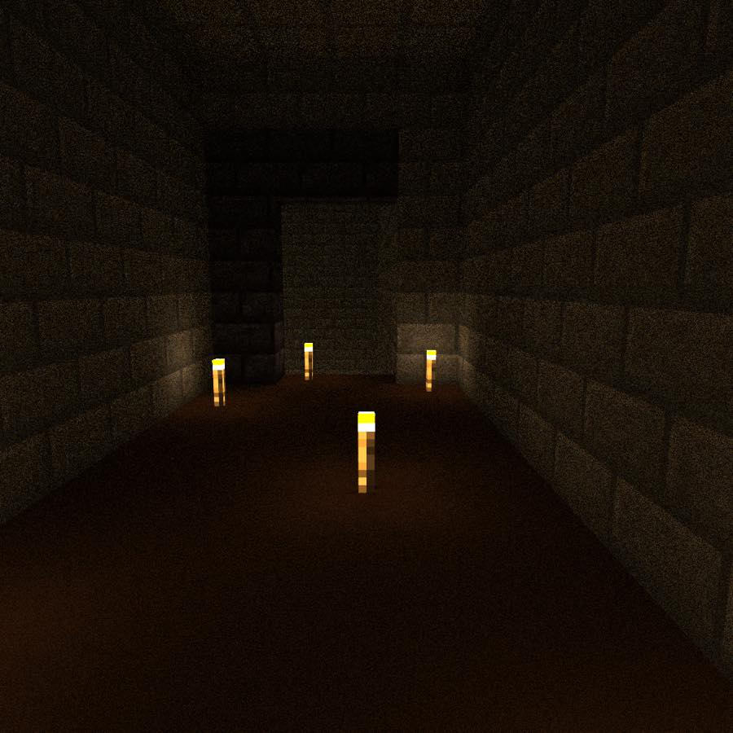
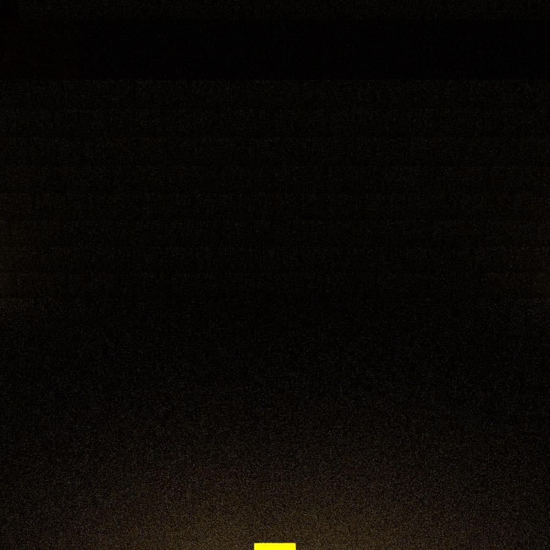
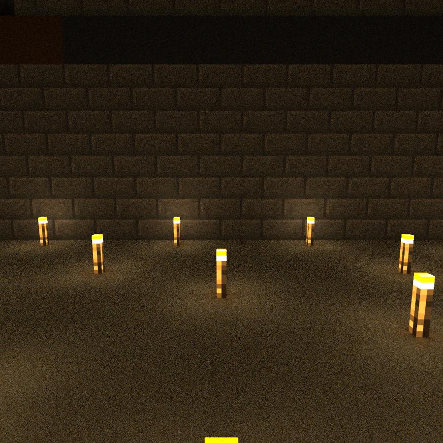

# The Derived Whole

Five places, four small JSON documents, and not one line that describes a block.

The level is walked to answer a question a picture cannot: **does a map you never
built read as a map?** Its second half answers a different one, about the checks
that judge such a map: **are they reading the blocks, or reciting the arithmetic
that laid them?**

The campaign is `campaigns/the-derived-whole/`. It lives there and not here
because `tools/campaign-build.py` — the gate that builds every campaign on every
pull request — takes its population from `campaigns/`, with no flag. A
campaign-shaped level under `demos/` would be built by nothing. What lives here
is the exhibit.

---

## The four documents

A site-plan campaign has one placement authority and it is not `areas[]`. Four
documents describe the map, and the mass a body walks is derived from them and
from the metrics table by `delvec build`, every build:

| document | what it holds |
|---|---|
| `world.json` | `"areas": []` — the whole of its contribution to placement |
| `geometry-brief.json` | three numbers with names |
| `layout-graph.json` | five places and five connections, before any coordinate exists |
| `site-plan.json` | one box per place, one seam per connection, in world coordinates |

There is no blockout document. There is nothing to author early: the only path
to blockout bytes is the derivation, and its only input is a validated site
plan.

## The map

`plan-sheet.txt` is the whole thing at one character per block, drawn from the
plan's own numbers. `#` is the one-cell shell the derivation writes around every
place; `=` a walk seam, `/` the stair, `X` the barred way, `v` the drop.

```
z  6 |  ######dddddddddddd#                   |
z 10 |  #eeee=dddddddddddd#                   |   vault -> lip, arch 2x3
z 18 |  #eeee#######X##############           |   the bar, door 1x2
z 19 |  #eeee#cccccccccccccccccccc#           |
z 23 |  ##vv##################//############  |   the hole (drop) | the climb
z 24 |   #aaaaaaaaaaaaaaaa#bbbbbbbbbbbbbbbb#  |
z 30 |   #aaaaaaaaaaaaaaaa=bbbbbbbbbbbbbbbb#  |   hub -> gallery, passage 3x3
z 39 |   #aaaaaaaaaaaaaaaa#bbbbbbbbbbbbbbbb#  |
```

| | place | class | footprint | floor | headroom | floor block |
|---|---|---|---|---|---|---|
| a | `node/hub` | `size_class` hall | 16 × 16 | y 64 | 14 | white concrete |
| b | `node/long-gallery` | `size_class` room | 16 × 16 | y 64 | 8 | light grey concrete |
| c | `node/upper-walk` | `way_class` road | 20 × 4 | y 69 | 6 | grey concrete |
| d | `node/vault` | `size_class` room | 12 × 12 | y 69 | 8 | black concrete |
| e | `node/lip` | `way_class` corridor | 4 × 16 | y 69 | 5 | brown concrete |

Nobody chose those colours. The blockout palette is fixed in the compiler, and a
place's floor is its accent, cycled over the plan's own document order — so the
colour under a body's feet says which place it is standing in, and it costs no
geometry. Walls are stone bricks, ceilings smooth stone, and the ring around
every seam's opening is polished blackstone, which is what makes a way out read
as one from across a room.



That frame is the claim: a floor whose colour names the place, a wall of courses,
and a doorway framed in a darker block than the wall it pierces. No line in any
of the four documents says any of it.

## Light, and what a green check does not prove

The blockout's only lighting surface is one setting for the whole map:
`{fixture, min_light}`. There is no per-room surface, because there are no rooms
yet — a blockout is massing.

At the schema's default of `min_light: 7` this map is **green**. `DW0210` has
nothing to say: every reachable walkable cell is at or above the light level the
plan asked for. Here is the hub at that setting, rendered at 300 samples:



And here is the same camera, same world, at `min_light: 12`:



Two things are worth taking from the pair. The engine's light model and a
walker's eye disagreed, and **only the frame could say so** — no check in the
ladder failed at 7. And the price of 12 is in the picture: free-standing torches
in a lattice across open floor, because a relight pass is an algorithm. Light in
a finished room is placed while the room is designed; this is what it looks like
when there is no room yet to design.

(A third thing, about the instrument rather than the level: at `-target 64` both
frames are noise. A torch-lit interior is judged at about 300 samples; 64 is for
checking what is in frame.)

## The exhibit — a plan edit and a regeneration are the same act

The gallery is sixteen blocks deep, and that number is the only thing in the
design that decides how the climb out of it is built. The rise is five. The
gentle standard is one block of rise per two of run, so it needs ten blocks, and
the derivation spends the run on the axis the seam's face points along. Sixteen
affords ten.

Take it to eight and nothing else changes anywhere. Three lines, in two
documents, and the middle one is the point. The whole transcript is
`exhibit.txt`.

**One.** Move the hub's doorway four blocks north, so that a sixteen-deep and an
eight-deep gallery both contain it:

```diff
-      "at": [ 30, 64 ],
+      "at": [ 26, 64 ],
```

That alone rebuilds green. 67 region writes over 12,325 cells; blockout
`97777a68…`.

**Two.** Now make the gallery eight deep:

```diff
-      "extent": [ 16, 16 ],
+      "extent": [ 16, 8 ],
```

The build refuses:

```
DW0833 [error] site-plan /content/identities/1: the plan does not keep
`fact/gallery-run`: `node/long-gallery`'s footprint on z measures 8, and the
brief asks for exactly 16 blocks. The brief's sentence was: "The depth of the
long gallery, and the only number in the design that decides the pitch of the
climb out of it. Ten blocks of run buys the gentle standard; anything under
that and the derivation has to spend the rise on a steeper one.". Either move
the geometry until the number is true, or change the brief's fact — in the
brief, where the design is written down, so that the change is a decision
somebody took rather than a plan that drifted.
```

The number was bound to a fact in the geometry brief, so shrinking the room is
not a thing that can happen quietly.

**Three.** Change the fact, in the brief, where the design is written down:

```diff
-        "value": 16.0,
+        "value": 8.0,
```

Green again. 58 region writes over 10,855 cells; blockout `dce6c572…`.

And the climb is a different building. Count the tread fills the two builds
emit:

| build | whole courses | bottom slabs | what that is |
|---|---|---:|---|
| gallery sixteen deep | 9 | 5 | the gentle pitch: one block of rise per two of run, so every second course lands on a half |
| gallery eight deep | 5 | 0 | the steep pitch: one block of rise per block of run, whole courses only |

Nobody wrote "ramp" and nobody wrote "stair". One number moved and the
derivation chose the other standard, because ten blocks of run stopped being
available. There is no hand edit to lose, because there was never a hand edit to
make.

## The observer, shown its own defect

The stage-5 battery claims to compare what the plan declares against what the
assembled bytes ARE — an observer, not a replay of the arithmetic that laid
them. That claim is worth nothing unless you can watch it fail.

You cannot get there by editing the campaign. The observer's two sides are the
plan and a derivation that is a pure function of that plan, so a document edit
moves both together; three tried here — a seam shifted one cell, two boxes
placed flush, a clearance dropped to 1 — and every one is refused at stage 4,
before a block is laid, by `DW0829`, `DW0828` and `DW0832`. So the derivation is
asked for a named defect instead:

```sh
delvec --prefabs prefabs build campaigns/the-derived-whole --perturb <knob>
```

The run writes nothing — `--out` is refused beside it — and always exits
non-zero, so a perturbed tree does not exist to be shipped, walked or admitted.
Full transcripts in `refusals.txt`.

### `--perturb slide-openings` — every hole cut a cell over

```
DW0836 [error] /content/seams[edge/the-bar]: the built world does not have the
opening the plan allocated for `edge/the-bar`. Of the 2 cell(s) between
`node/upper-walk` and `node/vault` at x 30..30 y 69..70 z 18..18, 2 are still
solid — the first at [30, 69, 18]. The graph declares a way here and the world
does not have one. Nobody wrote these blocks, so this is the derivation
disagreeing with the plan it was derived from rather than an authoring mistake:
the repair is in the compiler, not in the campaign.
```

Ten of these — **two per seam, from both directions at once**. Five say the
allocated cells are still solid, as above; five say the shared wall is open in
cells nothing allocated, which is where the slid opening landed. One `DW0838`
follows, because one of those unallocated holes joins two places. The message
names the cells, counts how many are still solid, and says which side of the
line the repair is on.

### `--perturb brick-up --perturb-place node/vault` — one place left solid

```
DW0837 [error] build: no body can reach `node/vault` in the built world. The
place offers 0 standable cell(s) inside x 24..35 y 69..76 z 6..17, and none of
them is reachable from the campaign's entry over the step rule, with every way
the campaign's own gating never opens shut. The layout graph proved this place
reachable over topology before any coordinate existed, so what has failed is
the embedding or the massing, not the design. Of 5 place(s), 3 are reached.
```

Two refusals, not one: the vault, and `node/lip` behind it, which offers its
64 standable cells and cannot be got to. The count of a place's own standable
cells is the tell — `0` for the bricked place, `64` for the one merely cut off.

### `--perturb short-walls` — every wall one course tall

```
DW0838 [error] /content/seams: `node/hub` and `node/long-gallery` are joined by
geometry the plan allocated no seam for. With every one of the 5 allocated
opening(s) removed from the world, a body standing in `node/hub` can still walk
to [37, 64, 24], which is inside `node/long-gallery`. **Seams are allocated,
not discovered**: a way that exists because a wall came out low, a corner did
not close or a roof turned out to be standable is a connection nothing in the
design agreed to and nothing downstream can name — not the graph, not the
pacing projection, not the bot. 2087 standable cell(s) were classified over 10
place pair(s) to find this.
```

Three of them, one per pair of places the low walls joined — the hub and the
gallery, the walk and the vault, the walk and the lip — plus five `DW0836` of
the second kind, one per shared wall, because a wall one course tall is a wall
that is open in every cell above it:

```
DW0836 [error] /content/seams: the wall at x 23..23 y 69..73 z 7..17 is open in
32 cell(s) the plan allocated no seam for — the first at [23, 70, 7]. The plan
cuts 1 opening(s) through this wall (edge/vault-to-lip), covering 6 cell(s);
everything else on it is wall.
```

### Why the pairs are a pair

Each of the three is shown beside the green build it perturbs, and the reason is
the binding line. Read the last number in each:

| run | standable cells classified |
|---|---:|
| the map as it ships | 1,808 |
| `slide-openings` | 1,811 |
| `brick-up node/vault` | 1,664 |
| `short-walls` | 2,087 |

The observer counts a different number of cells every time, because it is
counting cells in a world that is different every time. A check that recited the
plan's arithmetic would print the same number in all four.

## The build's own two binding lines

Part of the exhibit, because a green that examined nothing looks exactly like
this one:

```
blockout binding: 5 place(s) massed (0 detailed, so 5 massed by the
derivation), 5 seam(s) cut (1 stair, 1 barred), 0 whole-owned volume(s), 7
anchor(s) synthesized, 67 region write(s) over 12325 cell(s).

blockout battery binding: 5 seam(s) proven over 5 shared wall(s) (of them 0
contact(s), 0 crossable column(s) measured), 5 place(s) proven reached, 1808
standable cell(s) classified over 10 place pair(s), 0 sightline(s) walked, 3
identity(ies) re-measured (0 declaration-only), 5 critical-path leg(s)
measured.
```

Seven anchors, none of them written by anybody: `spawn`, one per place, and one
gate region over the barred seam. The quest layer names them exactly as it would
name a prefab's.

## What is in this directory

| path | what it is |
|---|---|
| `plan-sheet.txt` | the whole map at one character per block, drawn from the plan |
| `exhibit.txt` | the three builds of the plan edit, as the tool prints them |
| `refusals.txt` | the three perturbed runs, in full |
| `views/` | three frames: the lip, and the hub at both light levels |

## Build it yourself

Two engine revisions, and they are different on purpose.

The campaign builds, validates and walks on
[stellarfeline/delvewright](https://github.com/stellarfeline/delvewright) at
`417e12663330d70efb63ff65893b594a3847f310`:

```sh
git clone https://github.com/stellarfeline/delvewright.git ../delvewright
git -C ../delvewright checkout --detach 417e12663330d70efb63ff65893b594a3847f310
cargo build --release --manifest-path ../delvewright/Cargo.toml --workspace
export PATH="$PWD/../delvewright/target/release:$PATH"

delvec --prefabs prefabs build campaigns/the-derived-whole -o .out/delve
```

**`--perturb` is not in that revision.** It lands on the branch
`feat/the-observer-can-be-shown-its-own-defect`, at
`905a68dc406491ecc59d99304e9ea0016cab40de`, which is not merged. The three
refusals above were taken with a `delvec` built from it:

```sh
git -C ../delvewright fetch origin feat/the-observer-can-be-shown-its-own-defect
git -C ../delvewright worktree add --detach ../delvewright-observer \
    905a68dc406491ecc59d99304e9ea0016cab40de
cargo build --release --manifest-path ../delvewright-observer/Cargo.toml -p delvec

../delvewright-observer/target/release/delvec --prefabs prefabs \
    build campaigns/the-derived-whole --perturb slide-openings
```

When that branch merges, the second block collapses into the first.

## What this demo does not claim

- **Nobody has walked it.** The machine ladder is green — PackTest, and the bot's
  critical path — and no human has stood in it. Scale, pacing and whether the
  route reads are exactly the judgements a walk exists for, and they are open.
- **The lattice of torches is not a design.** It is what a relight pass does when
  there is no room yet to place a lamp in. It is in the pictures rather than
  cropped out of them.
- **The fifteen minutes is the session, not the route.** `target_minutes` is 15;
  the built map measures 126 blocks of route over 5 legs, about three minutes at
  the metrics table's uncalibrated rate. The rest is the plan edit and the three
  perturbed runs, which is what this level is for.
- **No combat, so three rungs of the ladder measure nothing.** The bot's
  die-retry and death-loop stages report *not run*, with their reasons, and the
  combat floor gate is absent rather than empty. A delve with nothing to fight
  is what that looks like, and it is stated rather than read as a pass.
