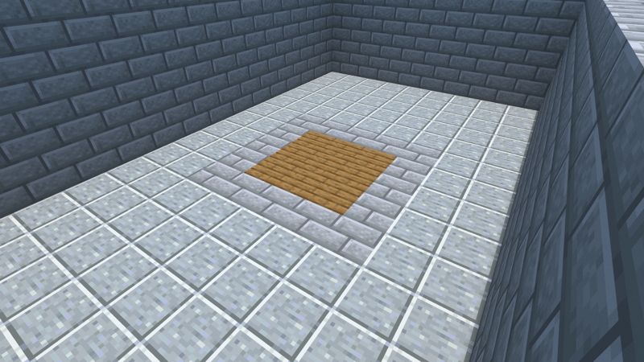
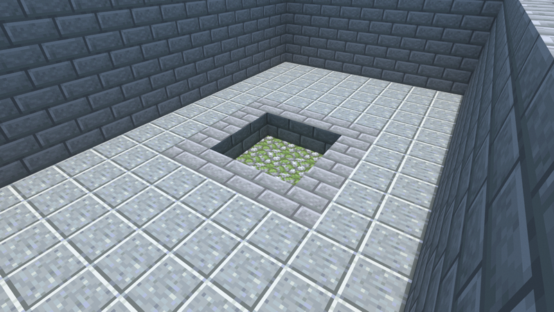

# The Same Room Twice

The demo level for **a camera that pictures the world as a story beat leaves
it** (spec-0089): `after` on a showcase camera, and the world the engine writes
for the configuration that step leaves — the same world every proof walks —
rendered from the same lens as the room at load.

The level is a campaign, so it lives where every campaign lives:

    campaigns/the-same-room-twice/

Its one piece, `prefab/same-room`, is in the prefab library
(`prefabs/same-room.{nbt,json}`) and is expanded from the grammar program
`campaigns/the-same-room-twice/design/programs/same-room.json` (11 × 6 × 17,
seed 1, named in `zones.json` beside it).

## What it is

One stone-brick hall, open to the noon sky, floored in polished andesite. You
arrive at its north end, facing south. A lever hangs on the far (south) wall.
In the middle of the floor is a 3 × 3 patch of spruce boards in a stone-brick
kerb, over a hollow one course deep floored with mossy cobblestone.

Pulling the lever clears the boards: the floor drops into the hollow, and the
middle of the hall is one course lower. You can step down into it and out of it.

## The two pictures

One lens (`pos` [9.5, 70.5, 14.5], yaw 146, pitch 35, `fov` 60), two cameras in
`campaigns/the-same-room-twice/design/cameras.json`:

| The room as you find it | The room after you pull the lever |
| --- | --- |
|  |  |

The second camera states `"after": {"step": "obj/pull-the-lever"}`. Nobody
built a second world for it: `delvec cameras` assembled the campaign, asked the
region model for the configuration the party is in once the lever is pulled,
and wrote that world itself; the scene loads it. The first camera states no
`after` and loads the world at load. The binding lines of that run:

```
after: the-room-as-found at load
after: the-room-after-the-lever after obj/pull-the-lever (step 3 of 6 on the critical path): 9 cells moved from load, 0 unforced write(s) not laid, 0 block entit(ies) omitted; biomes: at load; clock: as the picture
world: at-load 2 chunk(s), 583 cell(s), sha256 bca0caf5fdf311d265d2eae9c82513f2a13c4fcc5c7be992d1547ab8c4dd4077
world: after-obj-pull-the-lever 2 chunk(s), 574 cell(s), sha256 7e78b730511002e7b7678e6c41e5094860f6a9483f09de434e10320461cd1bfc
configurations: 2 written for 2 camera(s), 1 after a step, 1 at load
```

Nine cells moved: the nine boards. Rendered by `validation/chunky.sh` on the
pinned Chunky core at 1600 × 900, 128 samples, shown here at 800 × 450 (frame
sha-256 before scaling: as found
`940593ac62e593c7fbd994c780c04491a8160a2a51771a9f1177d5b6e20c62f0`, after the
lever `7936350068ab17bd0d7ececcd61ee79f15d8ab4c12bd78fe366381fe58023e68`). A
path-traced frame is not byte-reproducible; the hashes name these frames.

The two approved pictures the cameras answer (`design/concept/*.png`) are
stand-ins: a flat sky-and-floor gradient each, which nothing in the toolchain
opens.

## What to look for

1. At the spawn, look down the hall: a plain floor with a boarded patch in its
   middle, one lever at the far end. That is the first picture.
2. Walk to the boards (the first objective completes there), then on to the
   lever and pull it. *Behind you, the boards fall in.*
3. Walk back to where the boards were. The middle of the hall is one course
   lower, floored in moss. That is the second picture: the same corner of the
   room, as the beat left it.
4. Walk out. The delve completes.

## The refusals

The same campaign with one edit to the second camera, run through `delvec
cameras` over the same build. Verbatim, exit 2 each.

**A step the path never reaches** — `after.step` set to `obj/nowhere`:

```
DW0721 [error] design/cameras.json: camera `the-room-after-the-lever` states `after.step` `obj/nowhere`, which is no step of the critical path. A camera is taken after a step the path carries, named by its objective or trigger id. Steps: obj/stand-at-the-boards, obj/pull-the-lever, obj/look-again, obj/walk-out
```

**A beat that changes nothing** — `after.step` set to `obj/stand-at-the-boards`,
the first objective, after which no block has moved:

```
DW0721 [error] design/cameras.json: camera `the-room-after-the-lever` states `after.step` `obj/stand-at-the-boards`, and the world after it on the critical path is the world at load block for block: a picture of nothing different, which goes stale the moment a beat is added. REMOVE `after` from camera `the-room-after-the-lever`, or name a step after which a block moves — the first on the critical path is `obj/pull-the-lever`
```

**A branch the build does not declare** — `after.path` set to `branch/none`:

```
DW0721 [error] design/cameras.json: camera `the-room-after-the-lever` states `after.path` `branch/none`, which names no branch the build declares. Branches (validation/branch-plan.json): none
```

## What this level does not show

The design row for this level drops the floor *as rubble* and bars the way the
party came in. Neither is here. A `collapse` is not a region write the
configuration model lays — it reaches the route proofs as settled debris, not
through the per-configuration block map — so a frame after a collapse beat
would show the ceiling standing; that is the engine's recorded gap, and the
level uses a `clear-region`, which the model does lay. Barring the way in would
leave the respawn point behind the bars, so the beat changes the floor and
nothing else.

## The ladder

Built with an engine carrying spec-0089, which no released engine does yet:

- `delvec validate`, `delvec analyze`, `delvec build`: exit 0.
- PackTest (`validation/packtest-run.sh`): all 17 required tests passed, 0 live
  bootstrap fetches.
- Bot critical path (`validation/bot-run.sh`): `critical-path` stage ran and
  passed.
- Staging gate (`tools/creator/staging-gate.py`): stageable — all 122 findings
  carry a live, binding check or a justified exemption; 79 inapplicable.
